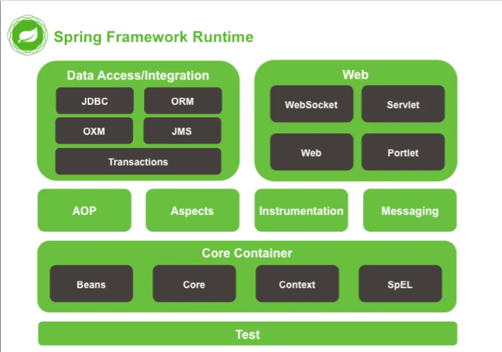

# Spring源码学习日记
## 2.Spring 由来
“Spring”这个词表示为一切的开始，表示一年四季中最先开始的第一季“春”。 

Spring诞生于2003年，诞生之初主要是解决J2EE规范的复杂性，然后慢慢发展至今成为Spring生态。

从Spring Framework 5.0开始，Spring需要Java EE 7+的版本，并且使用一些较新的API的话运行时需要Java EE 8。

- Spring框架API文档：https://docs.spring.io/spring-framework/docs/current/reference/html/index.html
- github源码：https://github.com/spring-projects/spring-framework/tree/5.3.x
- Spring官网：https://spring.io/

目前学习使用的是Spring框架的最新版：5.3.23

Spring 4.x 框架模块组成：
+ 核心容器（Beans，Core，Context，Spel），
+ 数据整合（JDBC，ORM，OXM，JMS，TX），Web（WebSOcket，Servlet，Web，Protlet），AOP，Aspects，Instrumentation，Messaging，Test。

注：下图只能在以前的Spring 4.x版本能够看到，Spring 5.x改版以后就没有了。

