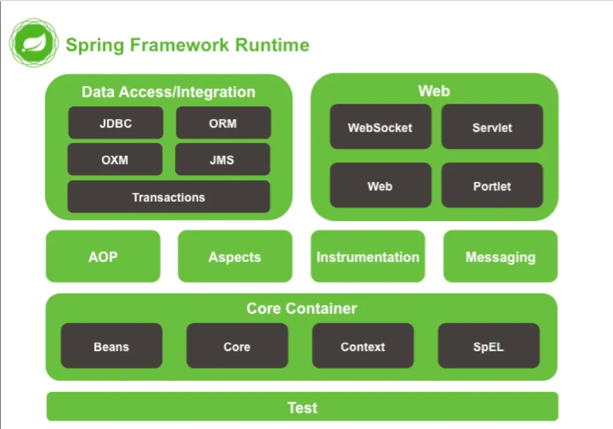
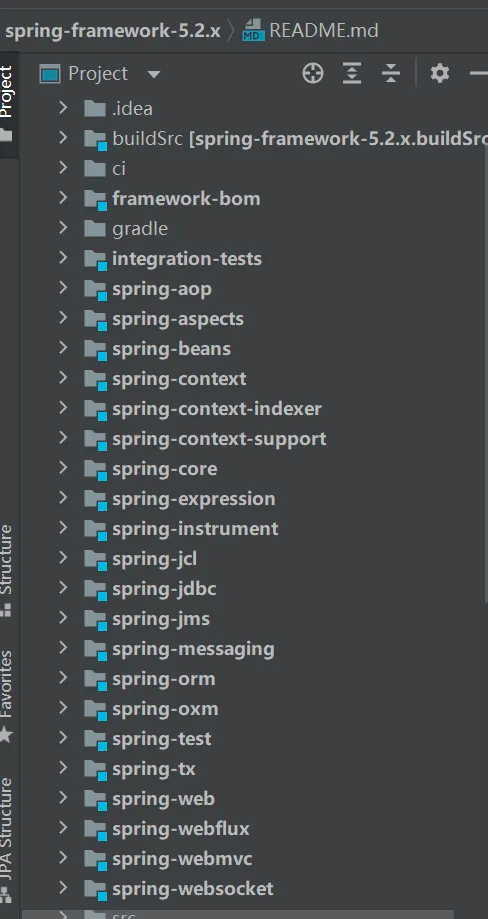
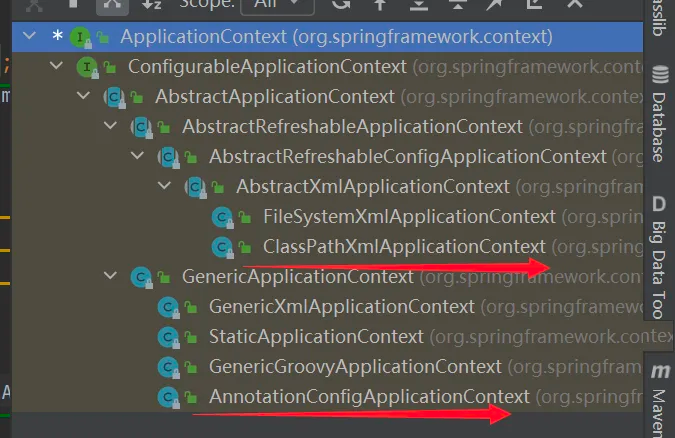

# Spring源码学习日记
## 1.Spring 由来
“Spring”这个词表示为一切的开始，表示一年四季中最先开始的第一季“春”。 

Spring诞生于2003年，诞生之初主要是解决J2EE规范的复杂性，然后慢慢发展至今成为Spring生态。

从Spring Framework 5.0开始，Spring需要Java EE 7+的版本，并且使用一些较新的API的话运行时需要Java EE 8。

- Spring框架API文档：https://docs.spring.io/spring-framework/docs/current/reference/html/index.html
- github源码：https://github.com/spring-projects/spring-framework/tree/5.3.x
- Spring官网：https://spring.io/

目前学习使用的是Spring框架的最新版：5.3.23

Spring 4.x 框架模块组成：
+ 核心容器（Beans，Core，Context，Spel），
+ 数据整合（JDBC，ORM，OXM，JMS，TX），Web（WebSOcket，Servlet，Web，Protlet），AOP，Aspects，Instrumentation，Messaging，Test。

注：下图只能在以前的Spring 4.x版本能够看到，Spring 5.x改版以后就没有了。



Spring 5.x版本模块：


### IOC容器

IoC（Inversion of Control，控制反转）就是把原来代码里需要实现的对象创建、依赖，反转给容器来帮忙实现。

我们需要创建一个容器，同时需要一种描述来让容器知道要创建的对象与对象的关系。

这个描述最具体的表现就是我们所看到的配置文件。

org.springframework.beans和org.springframework.context包是 Spring Framework 的 IoC 容器的基础。

该 BeanFactory 接口提供了一种高级配置机制，能够管理任何类型的对象。

ApplicationContext 是BeanFactory的子接口。

知识扩展：

```HTML
问：什么是JavaBean?
答：Java是一门面向对象语言，而bean的本质就是实体类
百度百科：https://baike.baidu.com/item/java%20bean/472664?fr=aladdin
```
#### 创建maven项目，导入maven依赖

```XML
<dependency>
    <groupId>org.springframework</groupId>
    <artifactId>spring-context</artifactId>
    <version>5.3.23</version>
</dependency>
<dependency>
    <groupId>org.springframework</groupId>
    <artifactId>spring-beans</artifactId>
    <version>5.3.23</version>
</dependency>
```
#### IOC容器的几种实现方式
现在我们已经知道ApplicationContext是BeanFactory的子接口， 并且也知道BeanFactory是用来管理容器的.

由此得知ApplicationContext也是管理容器的，再推出ApplicationContext的实现类也是同样的作用。

IDEA向下查看实现类快捷键：ctrl+h

IDEA向上查看接口和继承快捷键：CTRL+Alt+U

一般情况下，我们实现容器管理的方式大致分为XML和注解两种。

XML是早年比较常用的方式，

注解是现在流行使用的方式。

